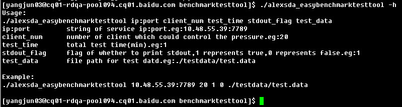
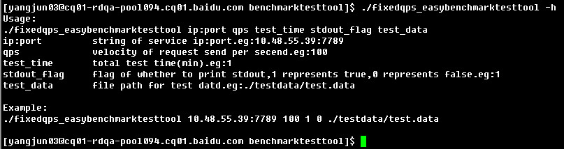

easybenchmarktesttool4pbrpc
=======================

a general benchmark test tool depends on protocol of pbrpc.this project try to find general solutions to benchmark test applying for a wide range of protocol such as http,rpc,redis,database,or general socket with the cpp programming language.the project is still being planned and in development stage,please pay attention to continuous update follwed-up. 

### Usage:
* alexsda_easybenchmarktesttool：亚历山大模式，根据服务端能力，按照服务端最大承受能力构造请求，适用于一般性能测试、压力测试、长时间稳定性测试、内存泄漏测试等。单进程压力可达到8万qps左右，使用方法如下：    
     

* fixedqps_easybenchmarktesttool：固定qps模式，根据需求固定qps发送，适用于一般性能测试，如测试服务在特定qps时稳定性，使用方法如下：        
      

